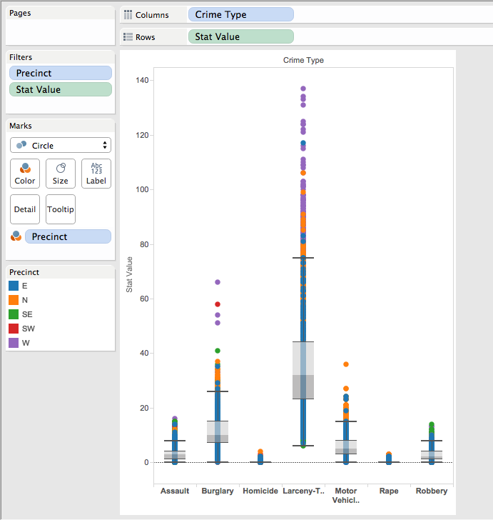
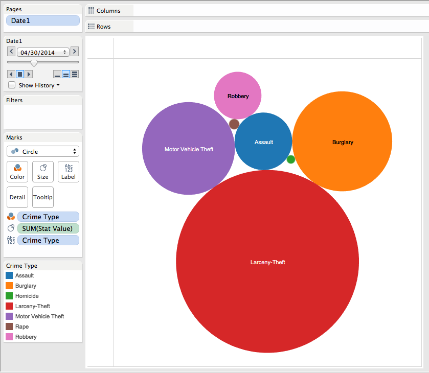
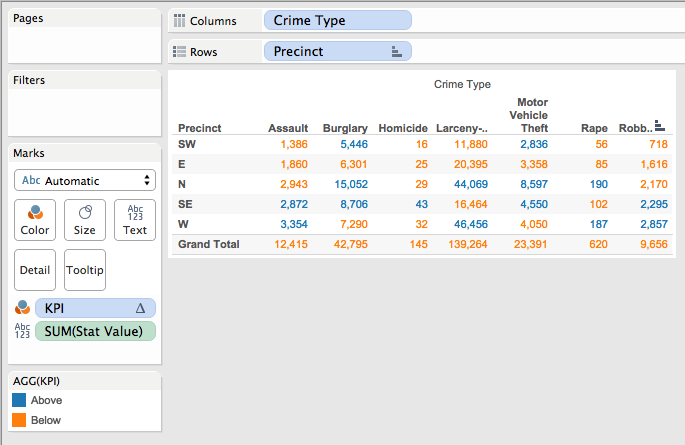
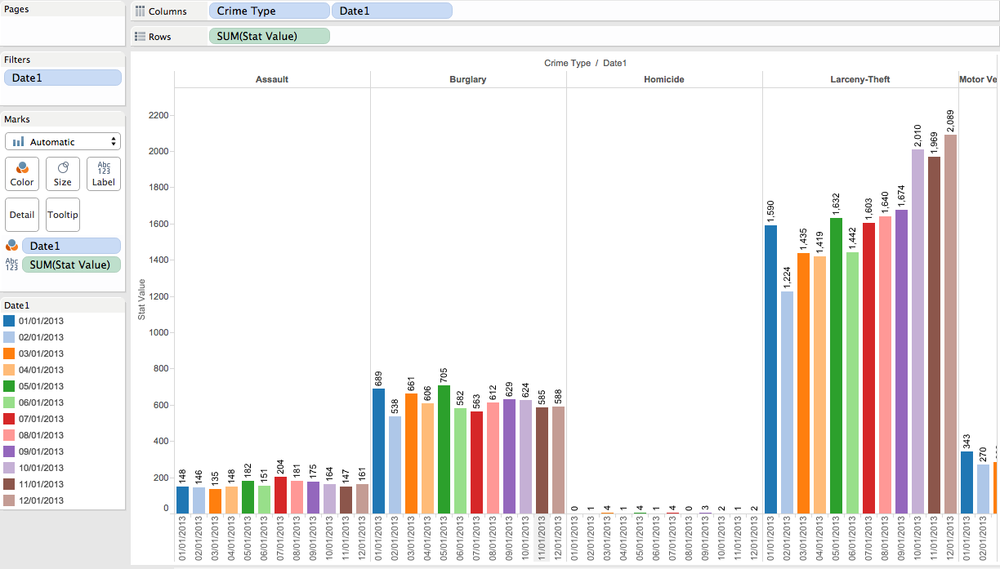
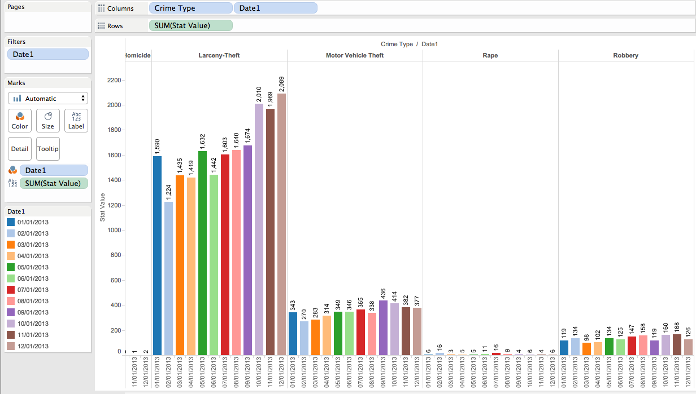
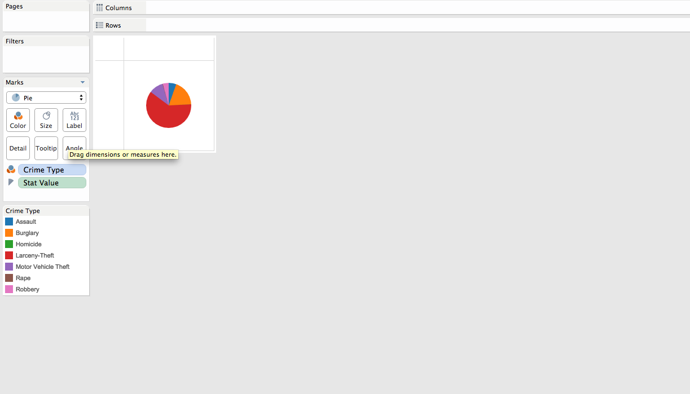
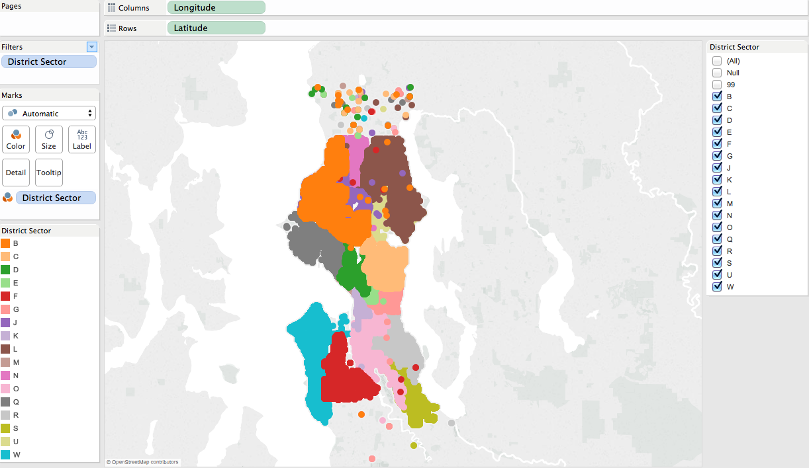
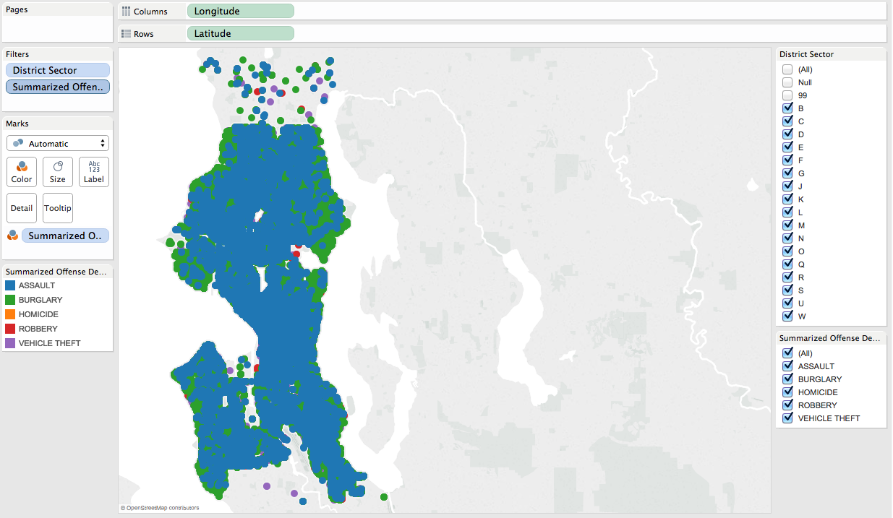
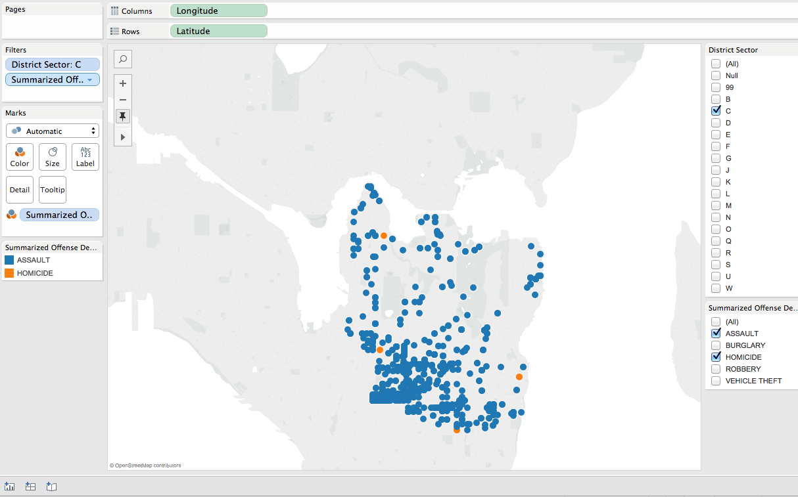
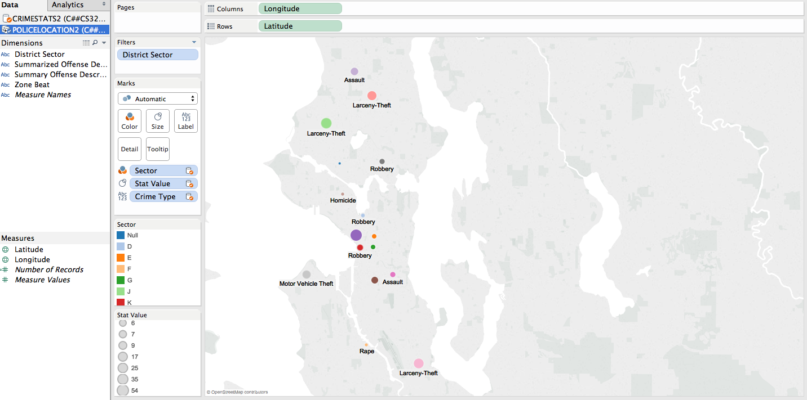

#The Steps

##Why We Picked Our Data?
For this project we choose a data set that will help us decided where to live after we graduate. We are both very interested in living in Seattle, and wanted to take a closer look at that city. We both come from very violent Latin American countries (Guatemala and Colombia), so saftey is the most important thing to consider when we are looking at a new city. Thus, we decided to use a data that presents the crime rates and crime types in Seattle, Washington. 

***

##STEP 1
The first thing that we did was actually find the data set. Here is a summary of our data set:
```{r}
source("../01 Data/SeattleSummary.R", echo=FALSE)

```
```{r}
source("../01 Data/SeattlePolice.R", echo = FALSE)
```

***
##STEP 2
The second step we took is to create the different visualizations in Tableau.

### BoxPlot (Non-Aggregated Measures Analysis)
The first visualization we created was the Box Plot. We began by dragging Stat Value(which is the number of incidents reported of a specific crime) to the Rows. We then dragged our Crime Type category into colums. This allowed us to compare the ranges that each type of crime had. Also, it is important to note that you have to uncheck Aggregate Measures when you are doing a box plot.We then decided to filter our visualization into precinct to see where in the city were the crimes occuring. We decided to color each precinct to see if there were sector of the city that had a higher type of crime than other. We discovered that the West side of the city had the most outliers(the higher stat values) making it the most dangerous zone. However, there were pretty even in homicide and rape which were the ones we were most concerned about, but there are very few homicides and rape so it was not much to take into consideration. So we figured that definietly we should stay away from the west side of Seattle.




***

###BubbleChart (Aggregated-Measures Analysis)
The next visualization we created was the bubblechart. We first dragged the Crime Type Dimension into our Marks as color to differenciate each one. Also, we dragged it to Labels so that it was clearer to see which one was which. We then dragged Stat Value as a sum to marks and size so that the bubbles would show magnitude as their value of Stat Value. We then dragged Date into Pages so that we could observe how the crime types have been changing since 2008 until 2014. It was interesting to see that Larcery-Theft, burgalry and robbery were the ones that were the most common, but Larcery-Theft was significantly larger. Again, homicide and rape were very small, almost insignificant. It was interesting to see that there does not seem to be a pattern of the number of crimes that are being commited. The crimes arent increasing or decreasing but just vary depending on the month. The correlation lies between the the time of the year rather than the actual years.


***
###CrossTab 
For our crosstab we dragged Crime Type to columns and Precinct to Rows. We then dragged the Measure of Stat_value to marks and we used it as text so that it would show. We then filtered the date so we can also se specifically how it has been changing. Then we decided to do a KPI that compares if the Total Stat Value was above or below the Average of the Stat Values per each Crime Type. Here we discovered that actually the North and the West were above average in Rape yet the South East was above average in almost all of them including Homicides. This gave us a good idea of where in Seattle would be the safest to live since it compared them directly.



***
###BarChart 
For the Barchart we dragged CrimeType and Date to the columns and the Stat Value to the Rows. This made it possible to compare the crimes directly with each other throughout the year. However in order to get only the dates of one year, we had to filter the Date and choose only the report date of the year we wanted to compare. We choose 2013 because it was the most recent one in which every month they had a report of the statistics, thus it was a complete data set. Also, we decided to mark the date with colors so it is easier to distinguish. What was interesting about this is that first when we had the date as pages, it seemed that there was some sort of a pattern which showed that at the end of the year more crimes happened. However when we got to see it displayed like this, we discovered that this was just the case for some crimes. Theft Crimes do show that at the end of the year there are more incidences, but for assault homicide and rape there was a pattern that the most incidents happend at the middle of the year. 



***
###PieChart 
We decided also to create a piechart becuase it gives us a different view of the Crime Type incidence. Do do this we dragged Crime Type and Stat Value to the Marks and gave color to the Crime Type and we put stat value in marks too. Tableau automatically gives the pie type to the stat value to divde it accordingly. Even though we already had an idea of how the pie chart was going to work out, it gives us a more impressive perspective when we see how much volume does each crime incidence has. It is amazing that Larcery-Theft takes about 60% of the whole crime types and homicide and rape are so small in magnitude that they don't even show up in the pie chart. 


***
###Map of Seattle (Non-aggregate Measures)
We decided that it would also be nice if we could actually display Seattle with a map to make it a bit different and more clear. We found another dataset that had the Latitudes and Longitudes and was also was about crime types in Seattle. We first dragged Longitude to columns and Latitude to rows. Then we divided it by sectors and to to this we dragged district sector to marks and gave it color. We saw that this gave us a clear visualization of where the sectors where located, because we did not know this. 


Since we already had done our analysis of the crime incidents, we decided that we would live in sector C because the EAST side of seattle was the safest according to our crosstab. This enabled us to look more closely at C and see where in C where the most crime incidents. To do this we filtered the District Sector and the Crime Type. We only showed the C sector so that enabled us to work with Crime Types only in the C sector.  We had to put a color Mark on the Crime type becuase we wanted to distinguish the different crime types easily and it turned out like this.


However this is too crowded so we decided to only display the homicide and assault which were the ones we were most concerned about. This is how it turned out:
 

***
#JoinDataSets
To be able to do our DataBlend we had to chose random samples of the sectors because if we had repeated observations, then it would get the average of the Latitude and Longitude for that specific sector and it would completley change the location. So after we had our chosen observations, we blended them by using the Latitude and Longitude locations of one dataset, and then using the sector and stat_value of the other data set. This allowed us to see where exactly did the homicide happen (asuming that they are close enough because of the sectors) and we gave it a mark size depending on the statvalue. 


***
##Shiny App
For our shiny app we decided to reproduce the CrossTab, the Barchart and the PieChart. For the Crosstab we decided to do 7 different KPI's each for one of the Crime_Type categories. In each one the max value is the stat value that each Crime Type and Precinct has, thus the user is only allowed to input a smaller number to see how the condition changes. If the number is below the average then it will display a blue color and if it is above it will display a pink color. This enables us to see by how much does each Crime Type need to be reduced in order for it to be in the below average part. For the barchart we decided to do Radio Buttons, which enabled us to see the crime type's stat value in each of the years. We did this by using a regular expression with a $ that looks for the last character in the string, so by changing our kpi value to whatever year we want, the graph that will be displayed is the one from the year chosen. Last, we decided to reproduce the pie chart. We had never done this type of visualization in R thus it was a challenge we wanted to take. Also, it gives a clear idea of the proportion of Crime Types in Seattle as a whole. We decided to use checkboxes so that the user could choose what Crime Types to show and compare it proportionally if it were only taking into account those crimes. 

<https://ams6624.shinyapps.io/SeattleCrime>

***
#Final Comments
We learned a whole lot in this class. We created a very interesting presentation, and it help us decide were we would want to live and what factors to consider when taking this decision. It was a challenging project, yet we are very pleased with our outcome and the knowledge that we aquired in R-Studio, Tableau, and Shiny. Thank you so much for a great class! 


